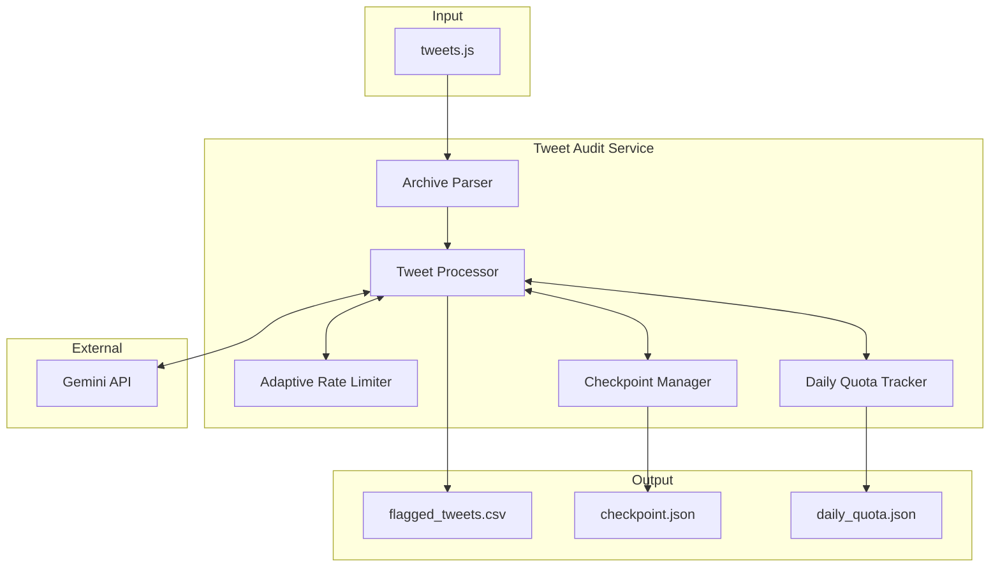

# Architecture and Design Decisions

**Project:** Tweet Audit
**Author:** Ridwan
**Date:** January 2025

This document explains the system architecture and key technical decisions, including the reasoning behind each choice.

---

## System Overview



## Component Architecture

```
TweetAuditService (Main Orchestrator)
    |
    +-- ArchiveParser        Parse tweets.js, filter retweets
    +-- GeminiClient         API calls with retry logic
    +-- AdaptiveRateLimiter  Response-based delay adjustment
    +-- DailyQuotaTracker    Persistent quota tracking (Pacific Time)
    +-- CheckpointManager    Resumable processing state
    +-- CSVWriter            Incremental result output
    +-- ProgressTracker      ETA and progress logging
```

## Data Flow

1. **Load** - Parse tweets.js, filter out retweets
2. **Resume** - Load checkpoint if exists, skip processed tweets
3. **Process** - For each batch:
   - Check quota before processing
   - Evaluate each tweet via Gemini API
   - Adjust rate limit based on response time
   - Append flagged tweets to CSV
   - Save checkpoint
4. **Complete** - Delete checkpoint on success

---

## Design Decisions

### 1. Processing Architecture: Batch vs Streaming

**Chosen:** Batch processing (manual, user-initiated)

| Factor | Batch | Streaming Service |
|--------|-------|-------------------|
| Complexity | Low | High |
| Resource Usage | Only during execution | Constant |
| Infrastructure | Simple JAR | Requires server/container |
| Debugging | Easier | More complex |

**Rationale:** Analyzing Twitter archives is typically a one-time or occasional task. Batch processing provides explicit user control and avoids infrastructure complexity. A streaming service would be appropriate for multi-user SaaS or real-time monitoring scenarios.

---

### 2. Rate Limiting: Thread.sleep() vs Libraries

**Chosen:** Thread.sleep() with manual quota tracking

| Approach | Handles RPM | Handles RPD | Dependencies |
|----------|-------------|-------------|--------------|
| Thread.sleep() | Yes | Manual | None |
| Guava RateLimiter | Yes | No | Guava |
| @Scheduled + Semaphore | Yes | Manual | Spring Context |

**Rationale:** Gemini has two limits: 15 RPM (easy) and 1000 RPD (hard). No library handles timezone-aware daily quotas. Thread.sleep() solves the RPM constraint with zero dependencies. The daily quota requires persistent state tracking regardless of approach.

---

### 3. Adaptive Rate Limiting

**Chosen:** Response-based delay adjustment

| Response Time | Action |
|---------------|--------|
| < 500ms | Reduce delay by 100ms |
| 500-3000ms | Keep current delay |
| > 3000ms | Increase delay by 500ms |
| 429 response | Double delay |
| 5xx response | Increase delay by 500ms |

Delays stay between 200ms (min) and 10s (max), starting at 1000ms.

**Rationale:** Fixed delays waste time when the API is fast. Exponential backoff only increases, never speeds up. Adaptive limiting finds the optimal throughput automatically.

---

### 4. Daily Quota Tracking

**Chosen:** Persistent JSON file with Pacific Time awareness

```json
{
  "currentDate": "2025-01-26",
  "requestCount": 145
}
```

**Rationale:**
- Persists across restarts (unlike in-memory)
- Timezone-aware (Gemini resets at midnight PST)
- Human-readable for debugging
- Uses existing Jackson dependency

A database would be overkill for a single-user CLI tool.

---

### 5. Quota Safety Threshold

**Chosen:** Stop at 95% (950/1000 requests)

**Problem discovered:** Hit 997/1000 locally, got 429 from Gemini. Clock drift and race conditions cause desync between client and server quota tracking.

**Industry standards:**
- AWS Lambda: 90% threshold
- GitHub API: 90% threshold
- Google Cloud: Alert at 95%

The 5% buffer provides a 50-request safety margin, preventing unexpected 429 errors while wasting minimal quota.

---

### 6. Graceful Shutdown

**Chosen:** Protected method extraction for testability

```java
protected void performShutdown(int exitCode) {
    System.exit(exitCode);
}
```

**Rationale:** Direct `System.exit()` kills the test suite. A protected method allows Mockito to spy and override. This is simpler than a full DI solution with `ShutdownHandler` interface.

**Note:** `SpringApplication.exit()` triggers cleanup but doesn't terminate the JVM. You need both `SpringApplication.exit()` (cleanup) and `System.exit()` (termination).

---

### 7. State Management: JSON + CSV Separation

**Chosen:** Separate checkpoint (JSON) and output (CSV) files

| Aspect | JSON + CSV | Single CSV | Database |
|--------|-----------|------------|----------|
| Resume Speed | O(1) Set lookup | O(n) file scan | O(1) indexed |
| Dependencies | Zero | Zero | DB server |
| Human Readable | Both | Yes | No |

**Rationale:**
- Checkpoint = runtime state (which tweets processed)
- CSV = final output (flagged tweets only)

Mixing them would require storing all tweets just for resume tracking.

---

### 8. Incremental CSV Writing

**Chosen:** Write after each batch, clear results list

**Critical bug fixed:** Forgot to clear the results list, causing exponential duplicates:
- Batch 1: 15 tweets
- Batch 2: 30 tweets (15 duplicates)
- Batch 3: 45 tweets (30 duplicates)

```java
csvWriter.appendResults(results);
results.clear();  // Essential!
```

---

### 9. Concurrency Model

**Chosen:** Sequential processing

| Model | Throughput | Rate Limit Compliance |
|-------|-----------|----------------------|
| Sequential | 15/min | Perfect |
| Batched (N=15) | 15/min* | Violates instantaneous limit |
| Fully Async | 15/min* | Complete violation |

*All limited by API rate limit, not code

**Rationale:** Gemini limits are per-minute, not concurrent connections. Parallel processing would send 15 requests instantly and violate the rate limit. Sequential is the only compliant approach.

---

### 10. Checkpoint Frequency

**Chosen:** Save after every batch (15 tweets)

- JSON write: ~1ms
- Gemini API call: ~2,000ms per tweet
- Batch time: ~30 seconds
- Checkpoint overhead: 0.003%

**Rationale:** Already pausing between batches for rate limiting. Checkpointing during that pause is natural and adds negligible overhead. Max loss on crash: 15 tweets.

---

### 11. Checkpoint Cleanup

**Chosen:** Auto-delete on success, preserve on crash

**On success:** Delete checkpoint for clean slate next run
**On crash:** Preserve for resume or manual inspection

```bash
# Resume after crash
mvn spring-boot:run

# Or start fresh
rm results/checkpoint.json
mvn spring-boot:run
```

---

### 12. Error Recovery

**Chosen:** @Retryable with exponential backoff + checkpoint error marking

| Config | Value |
|--------|-------|
| Max attempts | 3 |
| Initial delay | 2 seconds |
| Multiplier | 2.0 |
| Jitter | Enabled |

**Two-tier handling:**
1. **@Retryable (seconds):** Auto-recovery from transient issues
2. **Checkpoint marking (across runs):** Manual recovery from persistent issues

After 3 failed attempts, tweet is marked as ERROR and skipped on resume. User can delete checkpoint to retry.

---

### 13. Timezone Handling

**Chosen:** Pacific Time (America/Los_Angeles)

Gemini resets at midnight PST. Using local time (e.g., Berlin) would cause desync:

```
8:50 AM Berlin = 11:50 PM PT (Jan 14)
Local time thinks: Jan 15
Gemini thinks: Jan 14
Result: Desynchronized
```

**Principle:** Always use the authoritative service's timezone for quota tracking.

---

## Decision Summary

| Decision | Approach | Key Reason |
|----------|----------|------------|
| Architecture | Batch | Simplicity, occasional use case |
| Rate Limiting | Thread.sleep() | Zero deps, solves actual constraint |
| Adaptive Delays | Response-based | Optimizes throughput automatically |
| Quota Tracking | JSON (Pacific Time) | Persistent, timezone-correct |
| Safety Threshold | 95% | Prevents clock drift 429s |
| Shutdown | Protected method | Testable without over-engineering |
| State | JSON + CSV | Fast resume, clean separation |
| Concurrency | Sequential | Only rate-limit compliant option |
| Checkpointing | Per-batch | Aligns with rate limiting |
| Cleanup | Auto on success | Clean slate, preserve on crash |
| Retries | @Retryable | Industry standard |
| Timezone | Pacific Time | Matches Gemini's quota source |

---

## Key Learnings

1. **Quota tracking needs safety margins** - Hit 997/1000, got 429. Industry uses 90-95% thresholds.

2. **SpringApplication.exit() != System.exit()** - Spring's exit triggers cleanup but doesn't terminate JVM.

3. **Clear lists after batch writes** - Forgetting this caused exponential CSV duplicates.

4. **Timezone matters for quotas** - Gemini resets at midnight Pacific. Local time causes off-by-one errors.

5. **Rate limits are multi-dimensional** - RPM is easy; RPD requires persistent state regardless of library.

---

## References

- [AWS Builders Library: Timeouts, Retries, and Backoff with Jitter](https://aws.amazon.com/builders-library/timeouts-retries-and-backoff-with-jitter/)
- [Google Gemini API Quota Documentation](https://ai.google.dev/gemini-api/docs/quota)
- [Spring Retry Reference](https://docs.spring.io/spring-retry/docs/current/reference/html/)
