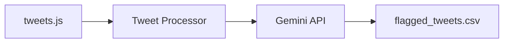

# Tweet Audit

Analyze your X (Twitter) archive using Gemini AI and flag tweets for deletion based on custom criteria.

## Overview

Flag tweets for deletion based on:
- Forbidden words or phrases
- Unprofessional content
- Old opinions you've moved on from
- Any custom alignment rules you define



For detailed architecture and design decisions, see [docs/ARCHITECTURE.md](docs/ARCHITECTURE.md).

## Tech Stack


## Quick Start

### Prerequisites

- Java 21+
- Maven 3.6+
- Gemini API key ([Get one here](https://aistudio.google.com/app/apikey))

### Setup

1. **Get your Twitter archive**

   Go to [x.com](https://x.com) > Settings > Your account > Download an archive of your data.
   Extract and place `tweets.js` in the `my_data/` folder.

   Sample data is available at `src/main/resources/sample-data/tweets-sample.js` for testing.

2. **Configure API key**

   Create `src/main/resources/application-dev.properties`:
   ```properties
   GEMINI_API_KEY=your_key_here
   ```

3. **Run**
   ```bash
   mvn spring-boot:run -Dspring-boot.run.profiles=dev
   ```

4. **Check results**

   Flagged tweets are written to `results/flagged_tweets.csv`.

### Running Tests

```bash
mvn test
```

## Configuration

Customize flagging criteria in `application.properties`:

```properties
alignment.forbidden-words=hate speech, racial slurs, threats of violence
alignment.context=Your personal context for evaluation
alignment.desired-tone=Casual, professional, authentic
alignment.check-professionalism=false
```

### Spring Profiles

- **Development:** `mvn spring-boot:run -Dspring-boot.run.profiles=dev`
- **Production:** Set `GEMINI_API_KEY` environment variable, use `-Dspring-boot.run.profiles=prod`

## Output

Generates `results/flagged_tweets.csv`:

```csv
tweetUrl,tweetId,status,matchedCriteria,reason
```

- `FLAGGED` - Tweet matches alignment criteria
- `ERROR` - Evaluation failed (network issues, API errors)

Clean tweets are not included in the output.

## License

Personal learning project - feel free to learn from it!
